# 🎓 Educational Interview Preparation App with Agentic AI

## 📌 Intro Description
**Educational Interview Preparation App with Agentic AI** is a **voice-interactive tool** that helps users practice job interviews in real time. Unlike static platforms, it **simulates realistic conversations**, evaluates answers, and provides **personalized feedback**.

By combining **AI-driven agents, speech-to-text, and text-to-speech**, the app adapts to each user’s skill level, tracks progress, and offers tips to improve **clarity, tone, and relevance**.  
It’s designed to make **interview preparation accessible, effective, and engaging** for everyone.

---

## 🗂️ Scheme

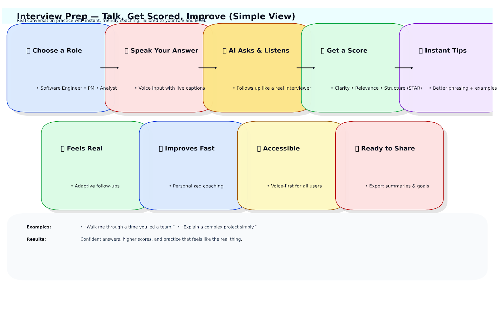

---

## 🧩 Examples

<table>
    <tbody>
        <tr>
            <td width="50%">
                
            </td>
            <td width="50%">
                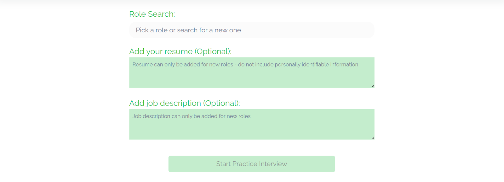
            </td>
        </tr>
        <tr>
            <td width="50%">
                
            </td>
            <td width="50%">
                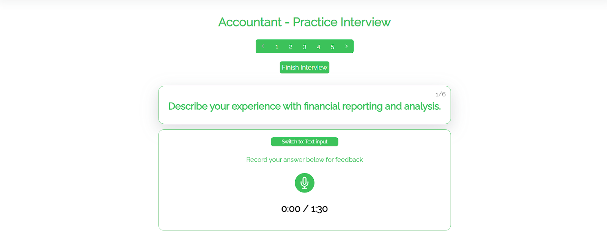
            </td>
        </tr>
        <tr>
            <td width="50%">
                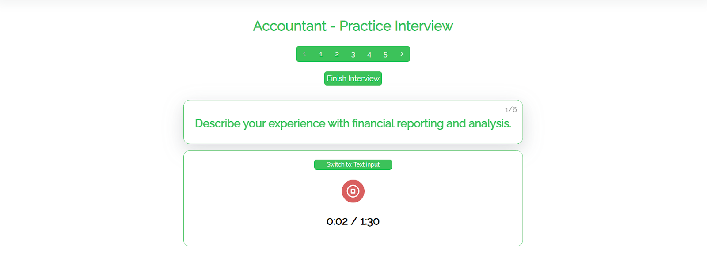
            </td>
            <td width="50%">
                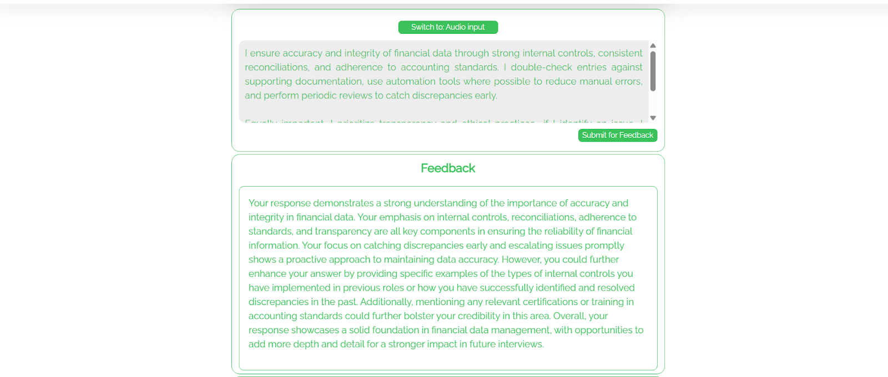
            </td>
        </tr>
        <tr>
            <td width="50%">
                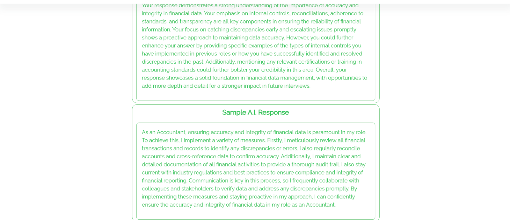
            </td>
            <td width="50%">
                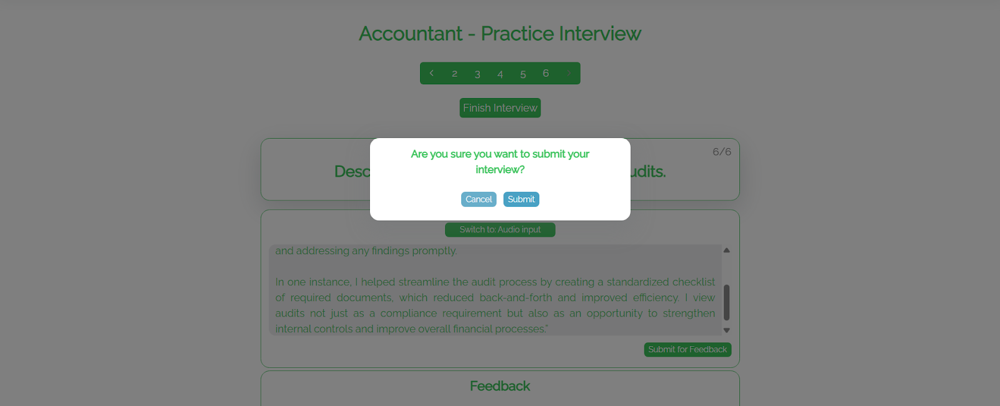
            </td>
        </tr>
        <tr>
            <td width="50%">
                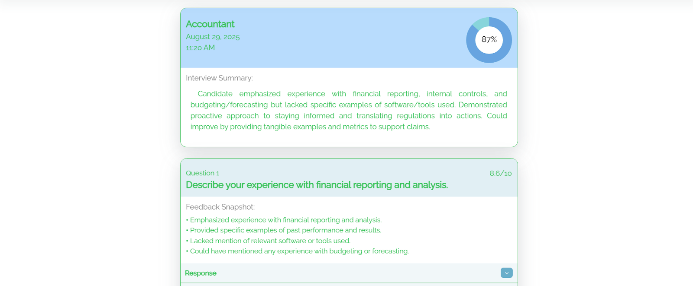
            </td>
            <td width="50%">
                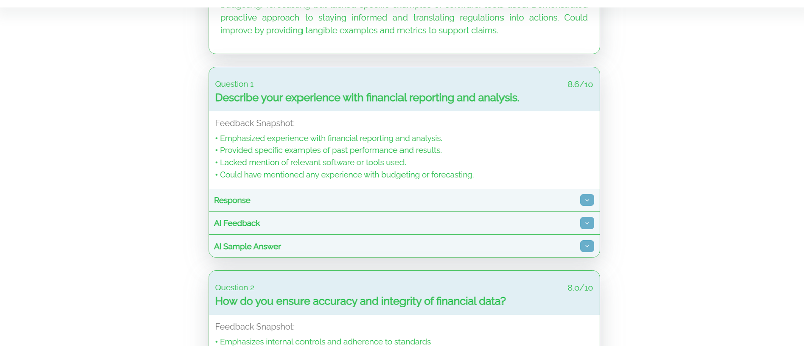
            </td>
        </tr>
        <tr>
            <td width="50%">
                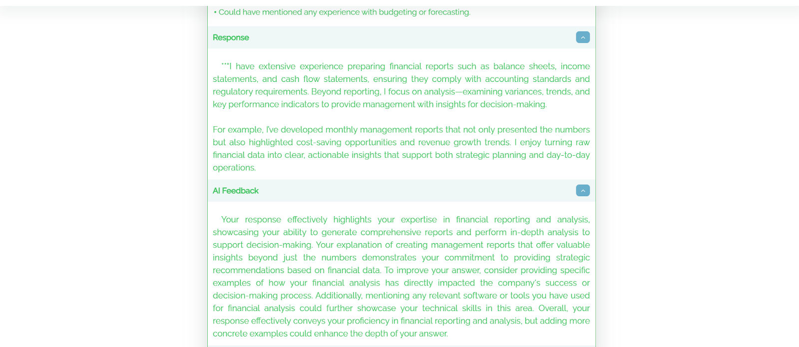
            </td>
            <td width="50%">
                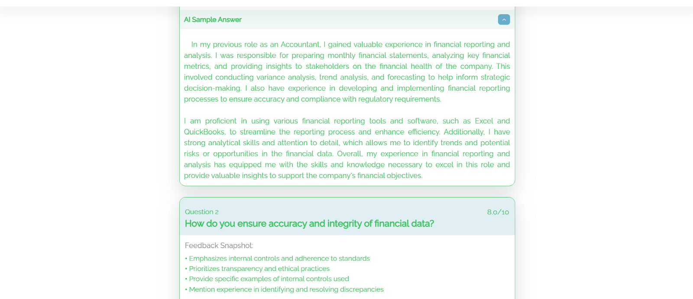
            </td>
        </tr>
        <tr>
            <td width="50%">
                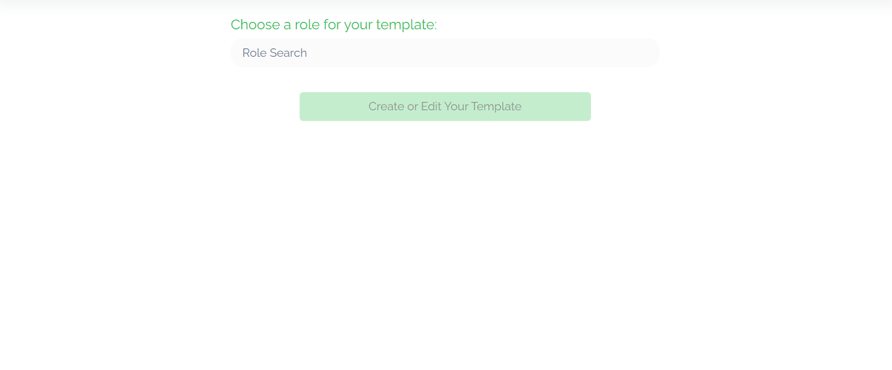
            </td>
            <td width="50%">
                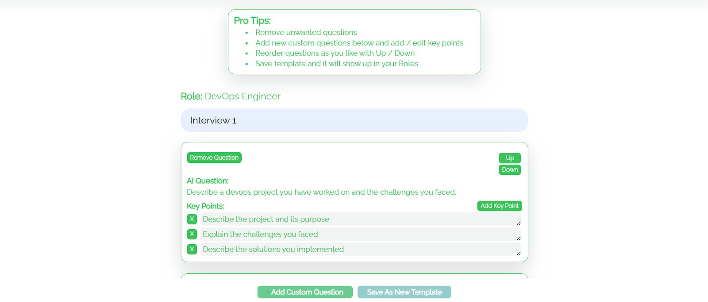
            </td>
        </tr>
    </tbody>
</table>

## 🎥 Video Examples

<table>
    <tbody>
        <tr>
            <td width="50%">
                <video src="https://github.com/user-attachments/assets/c406e7a4-704a-4c96-80c4-fda7a37b9b25" controls preload>
                    Your browser does not support the video tag.
                </video>
            </td>
            <td width="50%">
                <video src="https://github.com/user-attachments/assets/c5c38239-0d74-45d9-86ec-98bcf593ced3" controls preload>
                    Your browser does not support the video tag.
                </video>
            </td>
        </tr>
        <tr>
            <td width="50%">
                <video src="https://github.com/user-attachments/assets/7ddc5948-b7cd-4fae-85d7-08552cd061d9" controls preload>
                    Your browser does not support the video tag.
                </video>
            </td>
            <td width="50%">
                <video src="https://github.com/user-attachments/assets/a96b03f3-f497-4b01-a05c-09b70bb953b9" controls preload>
                    Your browser does not support the video tag.
                </video>
            </td>
        </tr>
    </tbody>
</table>

<table>
    <tbody>
        <tr>
            <td width="50%">
                <video src="https://github.com/user-attachments/assets/ec064854-2693-42cf-b901-8ccd0e7c440c" controls preload>
                    Your browser does not support the video tag.
                </video>
            </td>
            <td width="50%">
                <video src="https://github.com/user-attachments/assets/6720d7c5-8c77-45db-aaad-00c998671c8d" controls preload>
                    Your browser does not support the video tag.
                </video>
            </td>
        </tr>
        <tr>
            <td width="50%">
                <video src="https://github.com/user-attachments/assets/c23262b5-a87f-4ed9-b4b2-b4b5d4e6a3fb" controls preload>
                    Your browser does not support the video tag.
                </video>
            </td>
            <td width="50%"></td>
        </tr>
    </tbody>
</table>

<table>
    <tbody>
        <tr>
            <td width="50%">
                <video src="https://github.com/user-attachments/assets/d62663be-c86a-4500-a29d-9bdba5efec70" controls preload>
                    Your browser does not support the video tag.
                </video>
            </td>
            <td width="50%">
                <video src="https://github.com/user-attachments/assets/ecb0f7dd-5f26-415d-b60c-3473bb7196ce" controls preload>
                    Your browser does not support the video tag.
                </video>
            </td>
        </tr>
        <tr>
            <td width="50%">
                <video src="https://github.com/user-attachments/assets/36b13ac5-4a51-4c57-ae3e-0dc7c578fbc8" controls preload>
                    Your browser does not support the video tag.
                </video>
            </td>
            <td width="50%">
                <video src="https://github.com/user-attachments/assets/6dcdc85b-12ef-4ed0-bd0b-bf5ae6b261b1" controls preload>
                    Your browser does not support the video tag.
                </video>
            </td>
        </tr>
        <tr>
            <td width="50%">
                <video src="https://github.com/user-attachments/assets/41626e83-6198-4257-9279-8d162d6cb401" controls preload>
                    Your browser does not support the video tag.
                </video>
            </td>
            <td width="50%"></td>
        </tr>
    </tbody>
</table>

---

## 📊 Full Description

  
📖 Click to expand the Description

### 🛠 Problem Solved
Preparing for interviews often requires:
- ✅ Personalized practice
- ✅ Real-time feedback
- ✅ Realistic simulation

Traditional platforms fail to adapt, offering **static scripts** or **rigid Q&A**.  
This app solves the gap by providing **intelligent, voice-driven interview training** with **adaptive coaching**.

---

### 🚀 Solution & Achievements
- 🧠 **Agentic AI architecture**: Modular interview agents (questioning, feedback, hints).
- 🎤 **Full voice interaction**: Google STT/TTS + WebRTC for real-time conversations.
- 📊 **Feedback evaluation**: Assess clarity, relevance, and tone.
- 📚 **Progress tracking**: PostgreSQL memory system for personalized learning.
- 🤖 **Adaptive difficulty**: AI interviewer adjusts questions based on performance.

---

### 🔑 Key Achievements
- Built modular **LangChain + Mistral** agents for interview flow.
- Enabled **low-latency voice sessions** via WebRTC.
- Developed **feedback agents** for real-time scoring & tips.
- Integrated **context-aware memory** for personalized learning history.
- Supported **adaptive interview scenarios** (tech, HR, behavioral, etc.).

---

### 🧩 Training & System Highlights
- **Agentic AI Structure**: Specialized agents for questioning, evaluation, hints, and follow-ups.
- **Voice Interaction**: Google STT/TTS APIs + WebRTC for smooth speech-driven dialogue.
- **Feedback Loop**: Responses analyzed

